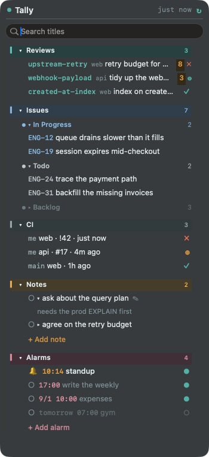

# Tally

A menu-bar widget for macOS that keeps the things you are on the hook for in one
place: **your open reviews, your issues, your notes, and your CI.**

Click the menu-bar item and the list drops down under it. Click again and it
closes. It does not steal focus, so you can keep it open while you work.

<p align="center">
  <br>
  
</p>

<p align="center"><sub>The counts live in the menu bar; the panel drops down when you click them.<br>Sample data — your own repos, issues and notes go in the same places.</sub></p>

- **Read-only.** Tally never writes to GitLab, GitHub, Plane or Jira. It only reads.
- **No dependencies.** Compiled with the `swiftc` that ships with macOS
  developer tools; data fetching uses the system `python3`. Nothing to install,
  nothing vendored.
- **Your tokens stay yours.** They live in `config.sh`, which is git-ignored.
  If you already ran `glab auth login` or `gh auth login`, you can keep *no*
  tokens on disk at all.

## Why

Reviews stall because nobody notices the comments. Issues drift because they
live in a tab you closed. CI breaks on a branch you pushed twenty minutes ago.
None of that needs a dashboard — it needs a glance.

## Install

Requires macOS 13+ and the Command Line Tools (`xcode-select --install`).

```bash
git clone https://github.com/ParkHaeBeen/tally.git ~/tally
cd ~/tally
cp config.example.sh config.sh && chmod 600 config.sh
$EDITOR config.sh          # see "Configure" below
./build.sh                 # compiles and makes Tally.app
./install.sh               # starts it, and starts it at login
```

Check it works without opening the window:

```bash
./fetch.sh                 # prints: reviews 5 · issues 18 · ci 4
./tally --dump             # prints the widget contents as text
```

To remove it completely: `./uninstall.sh && rm -rf ~/tally`.

## Configure

Everything lives in `config.sh`. The parts people change first:

```bash
export MW_LANG="en"                  # en | ko
export MW_REFRESH_HOURS="4"          # normal refresh interval
export MW_GITLAB_USER="your-name"    # only your MRs are listed
export MW_GITLAB_REPOS="
api|acme/backend/api|main
web|acme/frontend/web|main,develop
"                                    # name | path | branches to watch CI on
```

`./discover.sh` prints the ids that are annoying to find by hand — your Plane
workspace, project and user id, or a Jira connection check.

### Sources

| Source | What you get | Auth |
|---|---|---|
| GitLab | your open MRs, unresolved-comment counts, pipeline per MR | token, or an existing `glab` login |
| GitHub | your open PRs, comment counts, check runs | token, or an existing `gh` login |
| Plane | issues assigned to you, grouped by state | API key |
| Jira | issues from any JQL, grouped by status | Cloud API token or server PAT |
| Notes | a plain text file you own | — |
| CI | latest pipeline per branch, plus the ones you triggered | same as the forge |

Using something else? A source is a script that prints JSON — about ten lines.
And if the thing has a CLI, `sources/command.example.sh` turns any command's
output into a section with no code at all:

```bash
export CMD_TITLE="Unhealthy pods"
export CMD_LINE='kubectl get pods --field-selector=status.phase!=Running -o name'
export MW_EXTRA_SOURCES="sources/command.example.sh"
```

See [SOURCES.md](SOURCES.md) for the contract and `sources/` for working
examples (a static list, any command, Linear via GraphQL, Notion databases).

## How it behaves

**Refresh.** Every four hours, which is enough for reviews and issues. But when
a pipeline is running it switches to every two minutes, and when you push it
refreshes ~25 seconds later — so CI is current when it matters and quiet when it
does not. Pushes are noticed by watching the remote-tracking refs under
`MW_WATCH_DIRS` (no git hooks, no config changes to your repos).

**MR rows lead with the branch.** A branch name is easier to recognise than
`!199`, so that is what a review row starts with — prefixes like `refactor/` or
`feature/` are dropped and only the last segment is kept. The number and the
full branch are in the tooltip. Set `MW_MR_LABEL="number"` for the old look.

**Banners.** When a pipeline *you* triggered changes state, a banner slides in
at the top right: green ✓, red ✗, amber ◍, with a sound for pass and fail.
Click it to open the pipeline. Pipelines other people triggered stay silent.
Pick the sounds with `MW_SOUND_OK` / `MW_SOUND_FAIL` / `MW_SOUND_RUN` — a macOS
sound name, a path to your own file, or empty for silence. Audition them with
`./tally --sound-test`.

**Folding.** Every section folds, and so does every group inside Issues. Each
group shows the first 8 rows and a `+ N more`. The window height follows the
content up to 55% of the screen, then scrolls. Fold state is remembered.

**Text size and spacing.** Right-click the menu bar icon and open
**Appearance** — text size, line gap, item gap, section title size and window
width all change from there, redrawing as you click, with the current values
printed at the top of the submenu. Changes are stored in `ui-state.json`, never
written back to `config.sh`, so **Back to config file values** always returns
you to the file. To set the starting point in the file:

```bash
export MW_FONT_SCALE="1.0"           # text inside the sections; 0.8-1.6
export MW_HEAD_SIZE="12.5"           # section titles; ignores the scale, 9-20
export MW_LINE_SPACING="2.5"         # gap between lines, 0-14
export MW_ROW_GAP="1"                # gap between items, 0-14
export MW_WIDTH="320"                # window width, 260-560
```

The menu bar text and the banners ignore the scale — the menu bar height is the
system's to decide, and a banner has a fixed width. Widen the window when you
raise the scale, or more titles get truncated.

**Row under the mouse.** It gets a rounded tint, so what you are about to click
is obvious. `MW_HOVER="n"` turns it off; `MW_HOVER_STRENGTH` (0-100) sets how
strong it is.

**Alarms.** Set a time and a day and a banner appears then — and the row and a
bell in the menu bar (`🔔2`) stay lit **until you turn it off**. The banner fades
after 20 seconds; the mark does not, so a meeting you missed is still obvious
from the menu bar.

**+ Add alarm** asks in the same order an iPhone alarm does:

```
Time     [09 : 30] ▲▼
Repeat   [Every day] [Weekly] [Monthly] [Once]
         S M T W T F S              <- weekly only
What     [standup            ]
Sound    [Glass v]  [> Play]        <- default, silent, or any of the 14 macOS sounds
         [x] Remind me again in 10 min
```

Picking a repeat swaps the one row under it for days, day-of-month or a date.
macOS has no spinning wheel picker, so the time is an `NSDatePicker` — the same
control System Settings uses.

The list has a switch per alarm, as an iPhone does:

```
|>  Alarms                        4
  🔔 09:30  standup                ●   <- rang; the bell clears this one
  ○  Mon 08:00  write the weekly   ●
  ○  9/15 12:00  expenses          ●
  ○  tomorrow 07:00  gym           ○   <- off: dimmed, never rings
  + Add alarm
```

- **● / ○ on the right** turns the alarm itself on and off — resting it, not deleting it
- **the bell on the left** clears this occurrence; a repeating alarm rings again next time
- **the time or the title** opens the edit sheet, which has a Delete button
- **`Again in 10 min`** appears on the banner for alarms that asked for it

What you pick is stored in `alarm.txt`, still readable and still editable by hand:

```
daily 18:00       fill in the timesheet
mon,wed,fri 09:30 standup          sound=Glass snooze=10
off daily 07:00   gym              <- leading off = switched off
15th 12:00        expenses         sound=none
08-25 14:00       dentist          <- every year
2026-12-25 09:00  Christmas        <- once
```

`./tally --alarms` prints how each line was read, with its previous and next
occurrence — handy when a schedule does not do what you expected.

```bash
export MW_TITLE_ALARM="Alarms"
export MW_SOUND_ALARM="Ping"         # for alarms that do not name their own
export MW_ALARM_GRACE_HOURS="12"     # how long a missed alarm stays lit
```

Timers stop while the Mac sleeps, so alarms are recalculated on wake. Only what
was missed inside the grace window lights up; anything older goes quiet, or a
Monday morning would greet you with all of last week. An alarm you just made
never rings for a time that already passed today.

**Search.** Type in the box and reviews, issues and notes filter together by
title. Ids match too, so `42` finds `!42`. `ESC` clears it.

**Notes.** A note is a title plus optional detail, kept in `memo.txt` — the
title shows in the list, the detail unfolds when clicked. Finishing a note moves
it to `done.txt` rather than deleting it, and the menu can undo the last one.
There is a small CLI too:

```bash
./memo ask DBA about the query plan
./memo -d needs the prod EXPLAIN first
./memo -l
```

**Offline.** Away from the VPN, fetches fail. Tally keeps the last data and
labels it — `fetch failed · 5h ago` in red — rather than showing an empty list
that looks like good news.

## Files

| file | what |
|---|---|
| `widget.swift` | the window, menu bar, banners, search, folding, notes |
| `fetch.py` | reads your sources, writes `data.json` |
| `config.sh` | your settings and tokens (git-ignored) |
| `make-icon.swift` | draws the app icon in code → `icon.icns` |
| `build.sh` | compile, bundle, ad-hoc sign |
| `install.sh` / `uninstall.sh` | login item on/off |
| `sources/` | example plug-in sources |

State files (`data.json`, `memo.txt`, `done.txt`, `ui-state.json`, `tally.log`)
are all git-ignored and all plain text, so you can read or edit them by hand.

## Notes and limits

- **Notifications are drawn by Tally, not by macOS.** Unsigned apps are denied
  notification permission, and macOS pins the notification icon to the app icon
  anyway — so pass and fail would look identical. A window Tally draws itself can
  change with the state.
- The app is **ad-hoc signed** (`codesign --sign -`). That is enough to run and
  to sit in your login items; it is not notarised, so do not expect it to pass
  Gatekeeper on someone else's machine without a build of their own.
- Plane's REST API ignores `?state=` and `?assignees=`, so Tally pages through
  the project and filters locally. That costs about eight seconds; at a
  four-hour interval nobody notices.
- Multi-monitor: the window anchors under the menu-bar item on whichever screen
  holds it. If it ever ends up off-screen, the menu has **Snap under menu bar**.

## Theme

Six built-in palettes: `titanium` (default), `sage`, `ice`, `copper`, `deep`,
`soft`. Set `MW_THEME` and restart. Section colours (reviews teal, issues blue,
notes amber, CI grey) carry meaning, so they stay put across themes.

## License

MIT — see [LICENSE](LICENSE).
