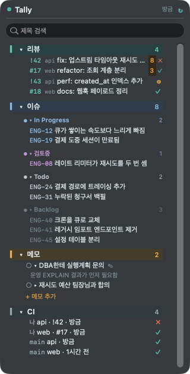

# Tally

<sub>**한국어** · [English](README.en.md)</sub>

내가 걸려 있는 일들을 메뉴바 한 곳에서 보는 macOS 위젯입니다.
**내 리뷰(MR·PR) · 내 이슈 · 내 메모 · CI 상태** 네 가지를 봅니다.

메뉴바를 누르면 아이콘 바로 아래로 목록이 펼쳐집니다. 다시 누르면 닫힙니다.
다른 창을 클릭해도 닫히지 않으니, 코드 보면서 곁눈질하기 좋습니다.

<p align="center">
  <br>
  
</p>

<p align="center"><sub>개수는 메뉴바에, 목록은 누르면 그 아래로.<br>화면에 보이는 것은 예시 데이터입니다.</sub></p>

## 무엇이 좋은가

- **읽기만 합니다.** GitLab·GitHub·Plane·Jira 에 쓰기를 하는 코드가 아예 없습니다.
  실수로 새로고침해도 남의 데이터가 바뀔 일이 없습니다.
- **설치할 게 없습니다.** 맥에 있는 `swiftc` 로 컴파일하고 `python3` 로 조회합니다.
  받아오는 라이브러리 0개입니다.
- **토큰은 내 맥에만.** `config.sh` 에 넣고, 그 파일은 git 이 추적하지 않습니다.
  `gh`/`glab` 로그인을 이미 해뒀다면 **토큰을 파일에 아예 안 둬도** 됩니다.

## 설치

macOS 13 이상, 그리고 커맨드라인 도구가 필요합니다 (`xcode-select --install`).

```bash
git clone https://github.com/ParkHaeBeen/tally.git ~/tally
cd ~/tally
cp config.example.sh config.sh && chmod 600 config.sh
open -e config.sh          # 아래 "설정" 참고해서 채우기
./build.sh                 # 컴파일 + Tally.app 생성
./install.sh               # 실행 + 로그인 시 자동 시작 등록
```

창을 열지 않고 내용만 확인하려면:

```bash
./fetch.sh                 # reviews 5 · issues 18 · ci 4  처럼 출력
./tally --dump             # 위젯에 보이는 내용을 텍스트로
```

완전히 지우려면: `./uninstall.sh && rm -rf ~/tally`

## 설정

전부 `config.sh` 한 파일에 있습니다. 한국어 화면을 원하면 이것부터:

```bash
export MW_LANG="ko"                  # ko | en
export MW_TITLE_CODE="MR"            # 칸 제목도 원하는 말로
export MW_TITLE_ISSUES="이슈"
export MW_TITLE_MEMO="메모"
```

### 쓰는 도구별 최소 설정

**GitLab** (사내 GitLab 도 됩니다)

```bash
export MW_GITLAB_HOST="gitlab.example.com"   # 사내면 이 주소
export MW_GITLAB_TOKEN=""                    # 비워두면 glab 로그인을 사용
export MW_GITLAB_USER="내아이디"              # 내 MR 만 모읍니다
export MW_GITLAB_REPOS="
api|group/sub/api|DEV,master
web|group/sub/web|develop
"
```
한 줄이 리포 하나입니다 — `표시이름 | 프로젝트 전체 경로 | CI 볼 브랜치들`.
브랜치 자리에 `-` 를 넣으면 그 리포의 CI 는 안 봅니다.

**GitHub**

```bash
export MW_GITHUB_TOKEN=""            # 비워두면 gh 로그인을 사용
export MW_GITHUB_USER="내아이디"      # 비우면 그 리포의 모든 열린 PR
export MW_GITHUB_REPOS="
web|myorg/web|main
"
```

**Jira** (Cloud)

```bash
export MW_JIRA_BASE="https://회사.atlassian.net"
export MW_JIRA_EMAIL="나@회사.com"
export MW_JIRA_TOKEN="..."           # id.atlassian.com 에서 발급
export MW_JIRA_JQL="assignee = currentUser() AND resolution = Unresolved"
export MW_JIRA_ORDER="In Progress,In Review,To Do,Backlog"
```
사내에 설치한 Jira(Server/DC)면 `MW_JIRA_EMAIL` 은 비우고 개인 액세스 토큰만 넣습니다.

**Plane**

```bash
export MW_PLANE_BASE="https://plane.example.com"
export MW_PLANE_KEY="..."            # Plane → 설정 → API 토큰
export MW_PLANE_WS="워크스페이스슬러그"
export MW_PLANE_PROJECT="..."        # 프로젝트 UUID
export MW_PLANE_ME="..."             # 내 사용자 UUID
export MW_PLANE_KEY_PREFIX="ENG"     # 이슈 링크가 ENG-123 형태가 됩니다
```

UUID 같은 건 손으로 찾기 번거롭습니다. **이 스크립트가 대신 찾아줍니다:**

```bash
./discover.sh          # 설정된 것 전부 확인
./discover.sh plane    # Plane 만
```
프로젝트 목록·멤버 UUID·상태 이름을 뽑아주고, `MW_PLANE_ORDER` 에 넣을 값까지
만들어서 보여줍니다. Jira 는 연결 확인과 상태 목록을, GitLab·GitHub 는 로그인
상태를 점검합니다.

### 상태 순서와 색

이슈 칸은 상태별로 묶입니다. 순서와 색을 직접 정합니다:

```bash
export MW_PLANE_EXCLUDE="Done,Cancelled"                  # 아예 숨길 상태
export MW_PLANE_ORDER="In Progress,Todo,Backlog,QA"       # 보여줄 순서
export MW_PLANE_STATE_COLORS="In Progress=blue,QA=purple,Backlog=dim"
```
색은 `blue`(진행) `plain`(대기) `dim`(먼 일) `purple`(검증) `green`(배포 직전)
`amber` 중에서 이름으로 고릅니다. 상태 이름이 `Doing`·`검토중` 이든 상관없습니다.

## 어떻게 동작하나

**조회 주기.** 평소엔 4시간입니다. 리뷰나 이슈는 그 정도면 충분합니다.
그런데 **파이프라인이 돌고 있으면 2분마다**로 빨라지고, **내가 원격에 올리면
25초 뒤에** 한 번 조회합니다. 그래서 CI 는 필요할 때만 민감하게 움직입니다.

올린 것을 아는 방법이 좀 재미있습니다 — git 에는 올린 뒤 실행되는 훅이 없으므로,
`MW_WATCH_DIRS` 아래에서 `.git/logs/refs/remotes/` 가 바뀌는지 지켜봅니다.
**훅 설치도, git 설정 변경도 없습니다.** 워크트리·복제본도 전부 잡힙니다.

```bash
export MW_WATCH_DIRS="$HOME/src"     # 이 아래 리포들을 감시
export MW_FAST_SECONDS="120"         # 빠른 조회 간격
```

**MR 줄 맨 앞.** 번호(`!199`)보다 브랜치가 눈에 익어서 브랜치를 씁니다 —
`refactor/` · `feature/` 같은 접두어는 떼고 마지막 조각만요. 번호와 브랜치
전체는 마우스를 올리면 나옵니다.

```bash
export MW_MR_LABEL="branch"          # number 면 예전처럼 !199
```

**배너.** 내가 돌린 파이프라인의 상태가 바뀌면 화면 오른쪽 위에 배너가 뜹니다 —
성공 초록 ✓, 실패 빨강 ✗, 시작 호박 ◍. 실패엔 둔탁한 소리, 성공엔 맑은 소리.
누르면 그 파이프라인 페이지가 열립니다. **남이 돌린 건 조용합니다.**

```bash
export MW_NOTIFY_CI="all"            # all | fail(실패만) | n(끔)
export MW_SOUND_OK="Tink"            # 맥 기본 소리 이름 · 내 파일 경로 · 빈 값(무음)
export MW_SOUND_FAIL="Basso"
export MW_SOUND_RUN=""
```

소리를 골라 들어보려면 `./tally --sound-test` 입니다.

**접기.** 칸마다 접힙니다. 이슈 칸 안의 상태 묶음도 따로 접힙니다.
묶음마다 8줄까지만 보이고 나머지는 `+ N개 더` 로 접힙니다.
창 높이는 내용에 맞춰 늘고, 화면의 55% 를 넘으면 안에서 스크롤됩니다.
접어둔 상태는 기억되므로, 맥을 껐다 켜도 그대로입니다.

```bash
export MW_ROWS_PER_SECTION="8"       # 0 이면 제한 없음
export MW_MAX_HEIGHT_PCT="55"
export MW_FOLDED_DEFAULT="issues"    # 처음에 접어둘 칸
```

**글자 크기와 간격.** 설정 파일을 열지 않고 **메뉴바 아이콘 우클릭 → 보기 설정**
에서 바로 바꿉니다. 누르면 그 자리에서 다시 그려지고, 하위 메뉴 맨 위에 지금
값이 적혀 있습니다. 바꾼 값은 `ui-state.json` 에 남고 `config.sh` 는 건드리지
않으므로, **설정 파일 값으로 되돌리기** 로 언제든 원래대로 옵니다.

```
보기 설정 ▸  지금  글자 108% · 줄 간격 5 · 항목 간격 3 · 칸 제목 11.5 · 창 폭 350
             글자 크게 ⌘+ / 작게 ⌘−
             줄 간격 · 항목 간격 · 칸 제목 · 창 폭  넓게 / 좁게
             올린 줄 강조 ✓ · 강조 진하게 / 연하게
             설정 파일 값으로 되돌리기
```

처음 값을 파일로 정해두고 싶으면:

```bash
export MW_FONT_SCALE="1.0"           # 칸 안의 글자. 0.8~1.6
export MW_HEAD_SIZE="12.5"           # 칸 제목(MR·이슈…). 배율과 무관, 9~20
export MW_LINE_SPACING="2.5"         # 줄 사이 여백 0~14
export MW_ROW_GAP="1"                # 항목 사이 여백 0~14
export MW_WIDTH="320"                # 창 폭 260~560
```

메뉴바 글자와 배너는 배율을 받지 않습니다 — 메뉴바 높이는 시스템이 정하고,
배너는 폭이 고정이라 키우면 글자가 잘립니다. 글자를 키울 때는 창 폭도 같이
넓히세요. 안 넓히면 제목이 더 많이 잘립니다.

**올린 줄 강조.** 마우스가 지나가는 줄에 둥근 배경이 깔려, 누를 대상이 분명해집니다.

```bash
export MW_HOVER="y"                  # n 이면 끔
export MW_HOVER_STRENGTH="60"        # 0~100
```

**알림.** 요일·날짜를 정해두면 그 시각에 배너가 뜨고, **끄기 전까지** 목록과
메뉴바에 종(`🔔2`)이 남습니다. 배너는 20초 뒤 사라지지만 표시는 남으므로,
자리에 없었어도 메뉴바만 보면 압니다.

아이폰 알람과 같은 순서로 고릅니다 — **+ 알림 추가** 를 누르면:

```
시각   [09 : 30] ▲▼
반복   [매일] [매주] [매월] [한 번]
       일 월 화 수 목 금 토          ← 매주일 때만
알릴 내용  [스탠드업            ]
소리   [Glass ▾]  [▶ 들어보기]      ← 기본·무음 + 맥 기본 14가지
       ☑ 10분 뒤 다시 알림
```

반복을 고르면 그 아래 한 줄만 요일·며칠·날짜로 바뀝니다. 굴리는 휠 피커는
macOS 에 없어서 시각은 `NSDatePicker`(시:분)로 고릅니다 — 맥 시스템 설정과
같은 컨트롤입니다.

목록도 아이폰처럼 알림마다 스위치가 있습니다:

```
▎▾ 알림                          4
  🔔 09:30  스탠드업              ●   ← 울림 · 종을 누르면 이번 회차만 끔
  ○  월 08:00  주간회고           ●
  ○  9/15 12:00  경비 정산        ●
  ○  내일 07:00  아침 운동         ○   ← 꺼둠 (흐리게, 울리지 않음)
  + 알림 추가
```

- **오른쪽 ●/○** — 알림 자체를 켜고 끕니다. 지우지 않고 쉬게 하는 것
- **왼쪽 종** — 이번 회차만 끕니다. 반복 알림은 다음 시각에 다시 울립니다
- **시각·제목** — 고치기 창(삭제 버튼 포함)
- **배너의 `10분 뒤 다시`** — 다시 알림을 켜둔 알림에만 붙습니다

정한 것은 `alarm.txt` 에 사람이 읽을 수 있게 저장됩니다. 손으로 고쳐도 됩니다:

```
매일 18:00        타임시트 쓰기
월,수,금 09:30    스탠드업          sound=Glass snooze=10
off 매일 07:00    아침 운동          ← 맨 앞 off = 꺼둔 알림
15일 12:00        경비 정산          sound=none
08-25 14:00       치과              ← 매년
2026-12-25 09:00  크리스마스        ← 한 번만
```

`daily` · `mon,wed,fri` · `1st` 같은 영어 표기도 읽습니다. 제대로 읽히는지는
`./tally --alarms` 로 확인할 수 있습니다 — 줄마다 지난 회차·다음 회차까지
찍어줍니다.

```bash
export MW_TITLE_ALARM="알림"
export MW_SOUND_ALARM="Ping"         # 알림별로 안 정했을 때 쓰는 소리
export MW_ALARM_GRACE_HOURS="12"     # 놓친 알림을 몇 시간까지 켜둘지
```

맥이 자거나 꺼져 있으면 타이머가 멈추므로, **깨어날 때 다시 계산**합니다.
이때 유예 시간(기본 12시간) 안에 놓친 것만 켜고 그보다 오래된 것은 조용히
넘깁니다 — 안 그러면 월요일 아침에 지난주 알림이 쏟아집니다. 방금 만든 알림이
"오늘 아침에 이미 지났다"고 울리는 일도 없습니다.

**검색.** 상자에 치면 리뷰·이슈·메모가 **동시에** 걸러집니다. 제목 기준이고
번호도 걸립니다(`42` → `!42`). `ESC` 로 풀립니다.

**메모.** 제목 + 상세로 이루어집니다. 목록에는 제목만 보이고 누르면 상세가
펼쳐집니다. 완료하면 지우지 않고 `done.txt` 로 옮기므로, 실수로 눌러도
메뉴의 **마지막 완료 되돌리기** 로 살립니다. 터미널에서도 됩니다:

```bash
./memo DBA한테 실행계획 문의
./memo -d 운영 EXPLAIN 결과가 먼저 필요함
./memo -l
```

**사내망 밖에서.** 조회가 실패하면 **마지막에 받은 내용을 그대로 두고**
`조회 실패 · 5시간 전 데이터` 라고 빨갛게 적습니다. 빈 목록을 보여주면
"할 일이 없다"로 오해하게 되니까요. VPN 켜고 `↻` 를 누르면 채워집니다.

## 우리 회사는 Jira 도 Plane 도 안 쓰는데

**스크립트 하나 쓰면 됩니다.** Tally 는 `data.json` 을 그릴 뿐이라,
JSON 을 뱉는 프로그램이면 무엇이든 소스가 됩니다.

```bash
#!/bin/bash
cat <<'JSON'
{ "key": "todo", "title": "할 일", "hue": "amber",
  "items": [ { "id": "1", "title": "청구서 정리", "url": "" } ] }
JSON
```

이걸 `sources/mine.sh` 로 두고 실행권한을 준 뒤:

```bash
export MW_EXTRA_SOURCES="sources/mine.sh"
export MW_SECTION_ORDER="code,issues,todo,notes,ci"
```

끝입니다. 상태별로 묶고 싶으면 `items` 대신 `groups` 를 쓰면 됩니다.

**코드를 아예 안 쓰는 방법도 있습니다.** `sources/command.example.sh` 는 아무 명령의
출력을 그대로 목록으로 만들어줍니다. `config.sh` 에서 명령만 지정하면 됩니다:

```bash
export CMD_KEY="pods"
export CMD_TITLE="비정상 파드"
export CMD_HUE="amber"
export CMD_LINE='kubectl get pods --field-selector=status.phase!=Running -o name'
export MW_EXTRA_SOURCES="sources/command.example.sh"
```

CLI 가 있는 것이면 이 방식으로 다 됩니다 — `kubectl` · `gh run list` ·
`brew outdated` · `docker ps` · `tail ~/notes/todo.txt` 같은 것들요.
`id <TAB> 제목 <TAB> 링크` 형태로 출력하면 번호와 클릭 링크까지 붙습니다.

**API 를 직접 부르는 예시**도 두 개 들어 있습니다 — `sources/linear.example.py`
(Linear GraphQL), `sources/notion.example.py`(Notion 데이터베이스). 이 둘을
베껴서 Asana·Trello·Redmine·Sentry·PagerDuty 같은 것에 맞추면 됩니다.

필드 전체 설명은 [SOURCES.md](SOURCES.md) 에 있습니다.

## 파일 구성

| 파일 | 무엇 |
|---|---|
| `widget.swift` | 창·메뉴바·배너·검색·접기·메모 — 보이는 전부 |
| `fetch.py` | 소스에서 모아 `data.json` 으로 |
| `config.sh` | 내 설정과 토큰 (git 제외) |
| `make-icon.swift` | 아이콘을 코드로 그림 → `icon.icns` |
| `build.sh` | 컴파일 + 번들 + 자체 서명 |
| `install.sh` / `uninstall.sh` | 자동 시작 등록/해제 |
| `discover.sh` | 찾기 번거로운 ID 들을 뽑아줌 |
| `sources/` | 소스 스크립트 예시 |

`data.json`·`memo.txt`·`done.txt`·`ui-state.json`·`tally.log` 는 전부 평범한
텍스트 파일이고 git 에서 제외됩니다. 손으로 열어보고 고쳐도 됩니다.

## 알아둘 점

- **알림은 Tally 가 직접 그립니다.** 자체 서명한 앱에는 맥이 알림 권한을 주지
  않고, 시스템 알림은 왼쪽 아이콘이 앱 아이콘으로 고정이라 성공·실패가 똑같이
  보입니다. 직접 그리면 상태에 따라 왼쪽 표시를 바꿀 수 있습니다.
- 앱은 **자체 서명**(ad-hoc)입니다. 내 맥에서 돌리고 로그인 항목에 넣는 데는
  충분하지만 공증(notarize)은 안 돼 있으니, 남에게 `.app` 을 건네지 말고
  각자 `./build.sh` 하게 하세요.
- Plane API 는 `?state=`·`?assignees=` 필터를 무시합니다. 그래서 프로젝트
  전체를 받아 직접 걸러냅니다 — 8초쯤 걸리지만 4시간에 한 번이라 문제없습니다.
- 모니터가 여러 대면 메뉴바 아이콘이 있는 화면에 붙습니다. 화면 밖으로
  어긋나면 메뉴의 **메뉴바 아래로 다시 붙이기** 를 누르세요.

## 테마

여섯 가지: `titanium`(기본) `sage` `ice` `copper` `deep` `soft`.
`MW_THEME` 을 바꾸고 재시작하면 됩니다.

칸 색(리뷰 청록·이슈 파랑·메모 호박·CI 회색)은 **뜻이 있어서** 테마와 무관하게
그대로 둡니다. 청록은 "내가 손댈 것", 호박은 "안 읽은 것", 회색은 "상태 표시".
CI 만 색을 안 준 이유는, 실패했을 때 빨간 ✗ 가 혼자 튀어야 하기 때문입니다.

## 라이선스

MIT — [LICENSE](LICENSE) 참고.
